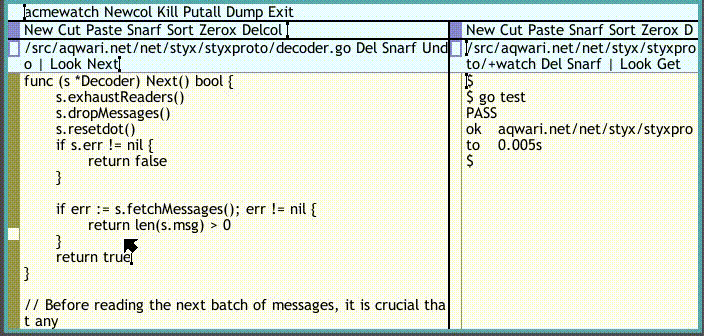

This is a version of 9fans.net/go/acme/Watch that uses the
gopkg.in/fsnotify.v1 Go library, instead of OSX-specific
libraries. It is also renamed to 'acmewatch' to avoid a name
collision with the standard `watch` utility found on most Linux
boxes.

# Install & usage

Acmewatch is for use within [acme][0]. Once you've [Go][1]
installed, run the following to download, build, and install
the command:

	go get github.com/droyo/acmewatch

From within acme, execute

	acmewatch command [args ...]

For example, to run `go test` whenever a file changes in the
current directory, execute

	acmewatch go test

It looks like this:

[0]: http://acme.cat-v.org/
[1]: https://golang.org/
